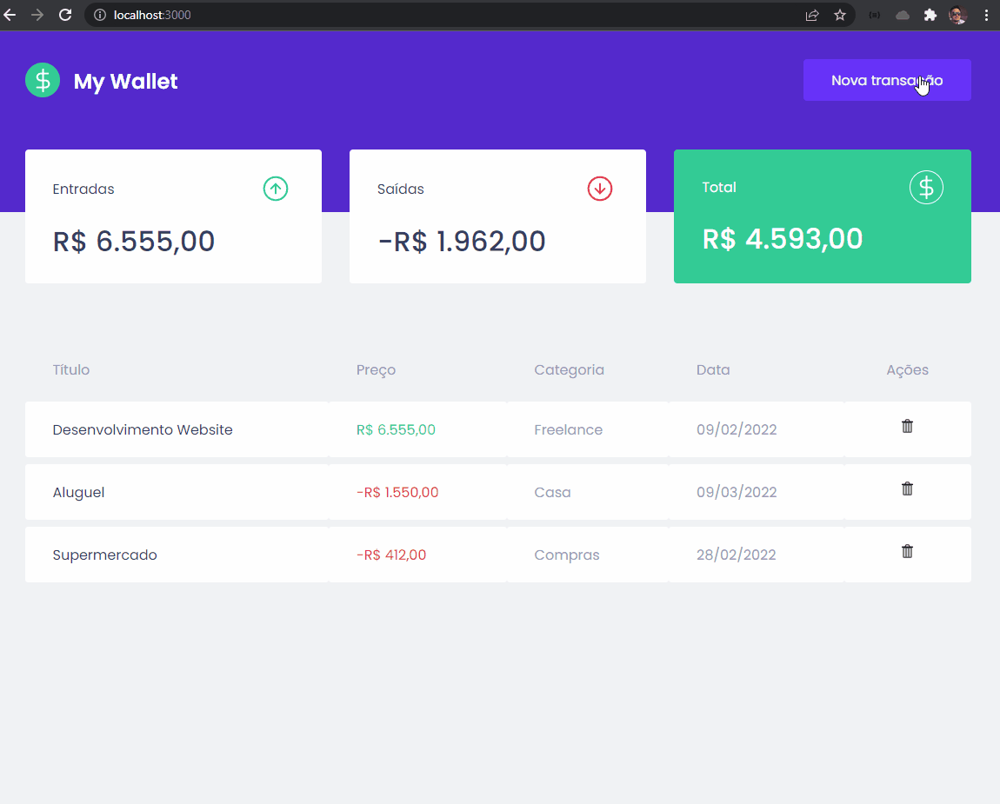

# Projeto My Wallet - Baseado no Dt Money
<br>
Projeto prático na trilha de React - Ignite

* [Sobre](#sobre)
* [Instalação](#instalação)


## Sobre
 * Aplicação abrangendo diversos conceitos e ferramentas do React inclusive Context-API
<br>


## Instalação

#### Pré-requisitos
Antes de começar a rodar o projeto, você precisa ter instalado em sua máquina as seguintes ferramentas: 
[Git](https://git-scm.com/), [NodeJs](https://nodejs.org/en/).<br>
Além disso, para facilitar a visualização do código você vai precisar de um editor: [VSCode](https://code.visualstudio.com/).

#### Rodando a aplicação 🚀


```bash
#realize o clone do repositório
$ git clone https://github.com/mauriciolsfilho/wallet
```
```bash
#acesse a pasta do projeto
$ cd wallet
```
```bash 
#instale as dependências (ex: utilizando yarn)
$ yarn
```
```bash 
#execute o projeto
$ yarn dev
```
_A servidor estará em execução em: localhost:3000_
